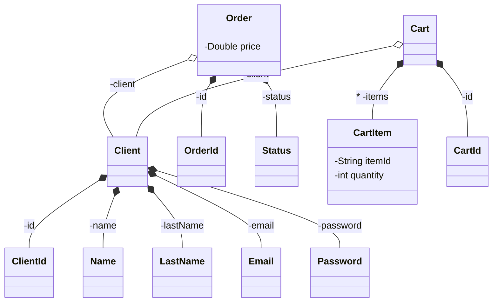

# Realfood-Clients

Servicio de clientes del TFM del Master CloudApps de la URJC

### Autores

- Juan Antonio Ávila Catalán, [@juanaviladev](https://github.com/juanaviladev)
- Cristo Fernando López Cabañas, [@cristoflop](https://github.com/cristoflop)

Este servicio contiene toda la funcionalidad asociada a los clientes de la aplicación RealFood, esta aplicación consta
de los siguientes componentes:

- [GitHub - Realfood-Clients](https://github.com/MasterCloudApps-Projects/realfood-clients)
- [GitHub - Realfood-Restaurants](https://github.com/MasterCloudApps-Projects/realfood-restaurants)
- [GitHub - Realfood-Payments](https://github.com/MasterCloudApps-Projects/realfood-payments)
- [GitHub - Realfood-Shipping](https://github.com/MasterCloudApps-Projects/realfood-shipping)

Estos servicios se ha desarrollado siguiendo el estilo
de [Arquitectura Hexagonal](https://es.wikipedia.org/wiki/Arquitectura_hexagonal_(software))

Operaciones disponibles en el servicio:

    Operaciones disponibles sin iniciar sesion

        - POST      /api/clients                        Registro
        - POST      /api/sign-in                        Iniciar Sesion

    Operaciones disponibles al iniciar sesion

        - GET       /api/clients/me                     Perfil
        - DELETE    /api/clients/me                     Borrar cuenta
        - GET       /api/clients/me/orders              Obtener pedidos
        - GET       /api/clients/me/orders/{orderId}    Obtener un pedido
        - GET       /api/clients/me/cart                Obtener mi carrito
        - DELETE    /api/clients/me/cart                Vaciar carrito
        - POST      /api/clients/me/cart/item           Añadir item al carrito
        - DELETE    /api/clients/me/cart/item           Borrar item del carrito
        - POST      /api/clients/me/cart/checkout       Iniciar un pedido

Operaciones de Publicación/Suscripción que ejecuta el servicio:

        - [Publish] Payment request                     Intento de pago de pedido
        - [Publish] Preparation request                 Solicitud de preparacion de pedido
        - [Publish] Shipment request                    Solicitud de envio de pedido
        - [Publish] Register user request               Evento de registro de cliente
        - [Publish] Delete user request                 Evento de borrado de cliente

        - [Consume] Payment response                    Respuesta de pago completado o no
        - [Consume] Preparation response                Respuesta de pedido preparado
        - [Consume] Shipment response                   Respuesta de pedido enviado
        - [Consume] Completed response                  Respuesta de pedido completado

Diagrama de clases del dominio de la aplicación:



Ejemplo de diagrama de clases para el caso de uso Checkout Cart:


## Despliegue

### Docker

- Despliegue de recursos (Solo BD y broker de RabbitMq)

```
$ docker-compose -f realfood-deply/docker-compose.yml up --build
```

- Despliegue completo (Recursos y servicio de clientes)

```
$ docker-compose -f realfood-deply/docker-compose-prod.yml up --build
```

- Para observar que se han creado los contenedores:

```
$ docker ps
```

Software recomendado: [Docker desktop](https://www.docker.com/) / [Rancher desktop](https://rancherdesktop.io/)

### Kubernetes

En la carpeta de realfood-deployment están los manifiestos para desplegar los recursos y el servicio

- Arrancar el servicio de minikube

```
$ minikube start
```

- Arrancar broker de RabbitMQ

```
$ kubectl apply -f rabbitmq-pv.yaml

$ kubectl apply -f rabbitmq-pv-claim.yaml

$ kubectl apply -f rabbitmq-deployment.yaml

$ kubectl apply -f rabbitmq-service.yaml
```

- Arrancar BD de clientes

```
$ kubectl apply -f sqldbclients-pv.yaml

$ kubectl apply -f sqldbclients-pv-claim.yaml

$ kubectl apply -f sqldbclients-deployment.yaml

$ kubectl apply -f sqldbclients-service.yaml
```

- Arrancar Servicio de clientes

```
$ kubectl apply -f clients-deployment.yaml

$ kubectl apply -f clients-service.yaml
```

- Para observar que se han desplegado los servicios:

```
$ kubectl get deployments

$ kubectl get services
```

- Si se quiere levantar todo directamente:
```
$ kubectl apply -f .
```

Software recomendado: [k8sLens](https://k8slens.dev/)
