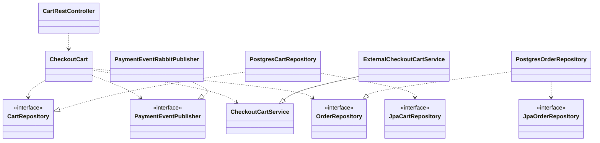

# Realfood-Clients

Servicio de clientes del TFM del Master CloudApps de la URJC

### Autores

- Juan Antonio Ávila Catalán, [@juanaviladev](https://github.com/juanaviladev)
- Cristo Fernando López Cabañas, [@cristoflop](https://github.com/cristoflop)

Este servicio contiene toda la funcionalidad asociada a los clientes de la aplicacion RealFood, esta aplicación consta de los siguientes componentes:

- [GitHub - Realfood-Clients](https://github.com/MasterCloudApps-Projects/realfood-clients)
- [GitHub - Realfood-Restaurants](https://github.com/MasterCloudApps-Projects/realfood-restaurants)
- [GitHub - Realfood-Payments](https://github.com/MasterCloudApps-Projects/realfood-payments)
- [GitHub - Realfood-Shipping](https://github.com/MasterCloudApps-Projects/realfood-shipping)

Estos servicios se ha desarrollado siguiendo el estilo de [Arquitectura Hexagonal](https://es.wikipedia.org/wiki/Arquitectura_hexagonal_(software))

Operaciones disponibles en el servicio:

    Operaciones disponibles sin iniciar sesion

        - POST      /api/clients                        Registro
        - POST      /api/sign-in                        Iniciar Sesion

    Operaciones disponibles al iniciar sesion

        - GET       /api/clients/me                     Perfil
        - DELETE    /api/clients/me                     Borrar cuenta
        - GET       /api/clients/me/orders              Obtener pedidos
        - GET       /api/clients/me/orders/{orderId}    Obtener un pedido
        - GET       /api/clients/me/cart                Obtener mi carrito
        - DELETE    /api/clients/me/cart                Vaciar carrito
        - POST      /api/clients/me/cart/item           Añadir item al carrito
        - DELETE    /api/clients/me/cart/item           Borrar item del carrito
        - POST      /api/clients/me/cart/checkout       Iniciar un pedido

Operaciones de Publicacion/Suscripcion que ejecuta el servicio:

        - [Publish] Payment request             Intento de pago de pedido
        - [Publish] Preparation request         Solicitud de preparacion de pedido
        - [Publish] Shipment request            Solicitud de envio de pedido

        - [Consume] Payment response            Respuesta de pago completado o no
        - [Consume] Preparation response        Respuesta de pedido preparado
        - [Consume] Shipment response           Respuesta de pedido enviado
        - [Consume] Completed response          Respuesta de pedido completado

Ejemplo de diagrama de clases para el caso de uso Checkout Cart:

## Despliegue

### Docker

- Despliegue de recursos (Solo BD y broker de RabbitMq)

        $ docker-compose -f realfood-deply/docker-compose-prod.yml up --build

- Despliegue completo (Recursos y servicio)

        $ docker-compose -f realfood-deply/docker-compose.yml up --build

- Para observar que se han creado los contenedores:

        $ docker ps

Software recomendado: [Docker desktop](https://www.docker.com/) / [Rancher desktop](https://rancherdesktop.io/)

### Kubernetes

- En la carpeta de realfood-deployment están los manifiestos para desplegar los recursos y el servicio

        $ minikube start

        $ kubectl apply -f .

- Para observar que se han desplegado los servicios:

        $ kubectl get deployments

        $ kubectl get services

Software recomendado: [k8sLens](https://k8slens.dev/)